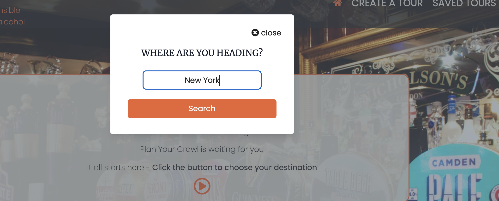
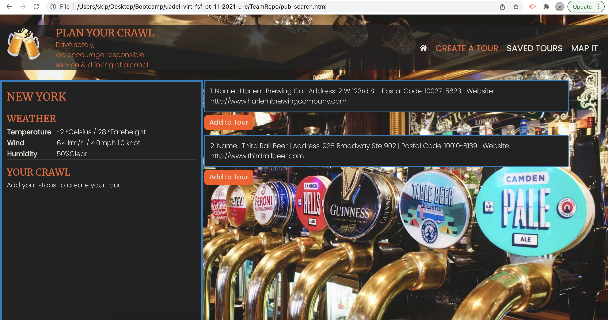
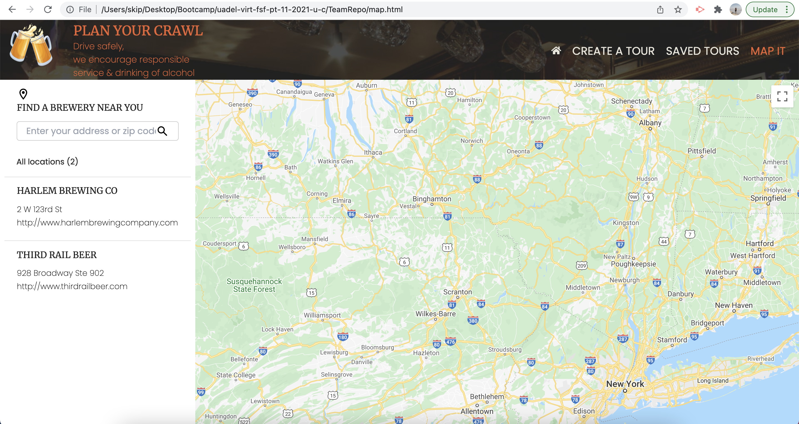

# TeamRepo
Plan Your Crawl:
A website that allows you to create a tour to all or some of the breweries in your area while having the ability to dress accordingly with the built in weather forecast.

## User Story
As someone looking to visit a new city, I want to enter that city into the application and find a list of breweries along with their location so that I can develop a route to visit different breweries and bottleshops in that city, and find the best route between them, along with the weather for that day.

## Acceptance Criteria

- Given a homepage with a form input
- When I search for a city
- Then I am presented with a list of brewery locations for that city
- When I have this list
- Then I can add them to a map to create a route
- When I have created my route
- Then I can store this as a saved route using local storage
- When I search a city
- Then I am also presented with the weather for that city
- When I view the weather
- Then I am presented with the temperature, the humidity, and the wind speed
- When I click on a stored route
- Then I am taken to the map of this route showing the locations on that route

## Usage:
The first thing that will happen when you arrive at our website is you will be asked if you are over the age of 21? if No you will not progress through to our website.

When you arrive at our website you will be greeted with the landing page that looks like this. 

To start planing your next brewery tour simply click the Play icon in the center of the homepage to choose your destination. Once clicked you will be asked "Where are you heading" This is where you put your search destination.

You will then be taken to another page that has a list of breweries, pubs etc. click "Add to tour" button to add them to your tour.

See previous tours constructed by clicking on the "saved tours" section in the nav bar.

Finally go to the "Map it" section of the nav bar to see where all your tours are in relation to each other. 

## Future Developments
The future developments for this webpage are:
- Looking to expand internationally 
- Turn tours into PDFs so that that a hard copy can be printed in order to make sharing easier.
- Sharing your tours via your social channels with friends and family.
- Data base intergration, Storing tours in a data base for future use.
- Contact form, implimenting a contact form so that users can share their best crawls.
- Authors and acknowledgment - DanLawrence91, SEO-Web, urorachama, skipsterling.

## Credits
Credits go to the Open Brewery data base https://www.openbrewerydb.org/
Created and maintained by Chris J Mears and Wandering Leaf Studios LLC.